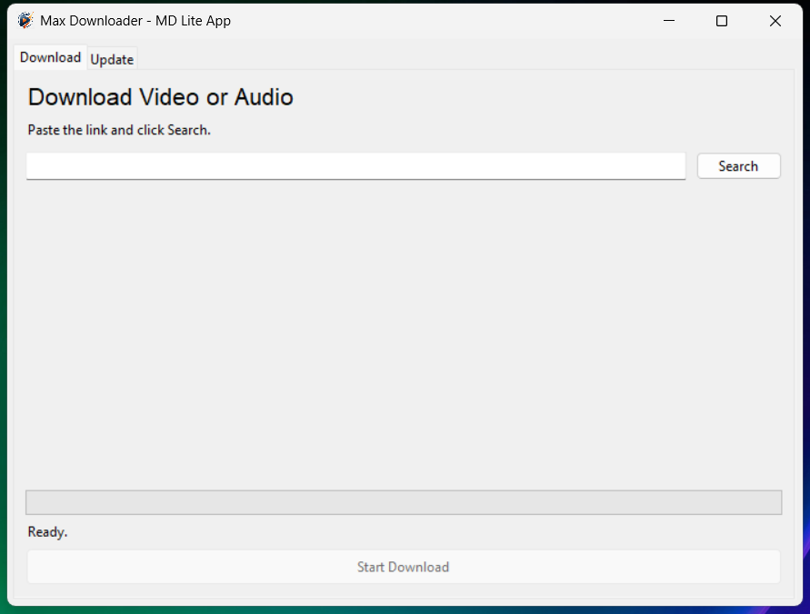
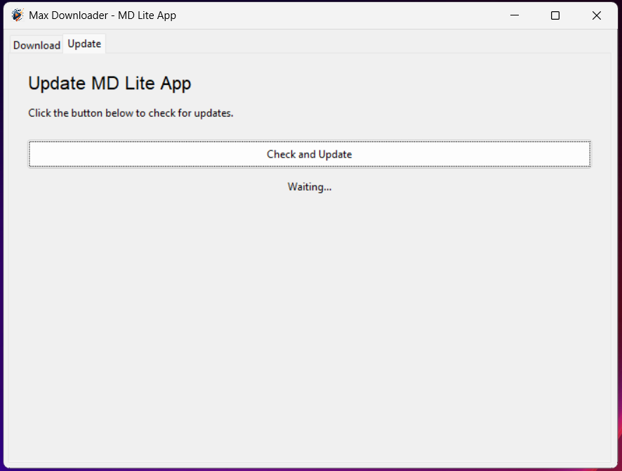

# 📥 Max Downloader — MD Lite App

> A lightweight, easy-to-use desktop video/audio downloader with a graphical interface, built on top of **yt-dlp** and **FFmpeg**.


---

## 📋 Table of Contents

- [About](#-about)
- [Features](#-features)
- [Screenshots](#-screenshots)
- [Download (Executable)](#-download-executable)
- [Installation (from source)](#-installation-from-source)
- [Requirements](#-requirements)
- [Usage](#-usage)
- [Supported Sites](#-supported-sites)
- [Output & File Structure](#-output--file-structure)
- [Download History](#-download-history)
- [Settings](#-settings)
- [Update](#-update)
- [Project Structure](#-project-structure)
- [Building the Executable](#-building-the-executable)
- [Troubleshooting](#-troubleshooting)
- [Contributing](#-contributing)
- [License](#-license)

---

## 📌 About

**MD Lite App** is a desktop application that lets you download videos and audio from YouTube and hundreds of other websites with just a few clicks. No command-line knowledge required. Simply paste a link, choose your options, and download.

It is built with Python using **Tkinter** for the interface and relies on the powerful **yt-dlp** and **FFmpeg** tools under the hood for all media processing.

---

## ✨ Features

- 🎬 **Download videos** in MP4 format with quality selection (1080p, 720p, 480p, 360p)
- 🎵 **Download audio** in MP3 format (best quality, re-encoded with FFmpeg)
- 📋 **Playlist support** — download an entire YouTube playlist into an organized folder
- 🌍 **Audio language selection** — choose a specific audio track when multiple languages are available
- 🔗 **Generic URL support** — works with YouTube and hundreds of other supported sites (Twitter/X, Vimeo, TikTok, etc.)
- 📁 **Custom output folder** — choose exactly where your files are saved
- 💾 **Download history** — keeps a local log of all your downloads with title, format, size, and timestamp
- 🔄 **Built-in updater** — update yt-dlp directly from the app's Update tab
- ⚙️ **Persistent settings** — remembers your last output folder and preferred format
- 📝 **Logging** — detailed logs saved locally for debugging

---

## 🖥️ Screenshots

| Main Download Tab | Update Tab |
|:-----------------:|:----------:|
|  |  |

---

## 📦 Download (Executable)

> **No Python installation required. No extra downloads needed. Everything is included.**

1. Go to the [**Releases**](../../releases) page
2. Download the latest `.zip` file
3. Extract it anywhere on your computer
4. Double-click `MD Lite App.exe` and you're ready to go

### Folder structure after extraction:

```
📂 MD Lite App/
├── MD Lite App.exe       ← Run this
└── 📂 _internal/         ← Do not delete or move this folder
    ├── yt-dlp.exe            (bundled)
    ├── ffmpeg.exe            (bundled)
    └── ...                   (app dependencies)
```

> ⚠️ **Important:** Keep the `_internal` folder in the same directory as `MD Lite App.exe`. The app will not work without it.

---

## 🛠️ Installation (from source)

### 1. Clone the repository

```bash
git clone https://github.com/YOUR_USERNAME/md-lite-app.git
cd md-lite-app
```

### 2. Install Python dependencies

```bash
pip install requests
```

> `tkinter` is included in the standard Python distribution. If it's missing on Linux:
> ```bash
> sudo apt install python3-tk
> ```

### 3. Download yt-dlp

yt-dlp is the core engine used to fetch and download media.

#### 🪟 Windows
1. Go to the [yt-dlp releases page](https://github.com/yt-dlp/yt-dlp/releases/latest)
2. Download `yt-dlp.exe`
3. Place it in the root of the project folder (next to `main.py`)

#### 🍎 macOS
```bash
brew install yt-dlp
```
Or download the binary manually:
```bash
curl -L https://github.com/yt-dlp/yt-dlp/releases/latest/download/yt-dlp -o yt-dlp
chmod +x yt-dlp
```

#### 🐧 Linux
```bash
sudo curl -L https://github.com/yt-dlp/yt-dlp/releases/latest/download/yt-dlp -o /usr/local/bin/yt-dlp
sudo chmod a+rx /usr/local/bin/yt-dlp
```
Or place it locally next to `main.py`:
```bash
curl -L https://github.com/yt-dlp/yt-dlp/releases/latest/download/yt-dlp -o yt-dlp
chmod +x yt-dlp
```

---

### 4. Download FFmpeg

FFmpeg is required for merging video/audio streams and converting to MP3.

#### 🪟 Windows
1. Go to [https://www.gyan.dev/ffmpeg/builds/](https://www.gyan.dev/ffmpeg/builds/)
2. Download `ffmpeg-release-essentials.zip`
3. Extract the archive
4. Inside the extracted folder, navigate to `bin/` and copy `ffmpeg.exe`
5. Create a `ffmpeg/` subfolder inside the project and paste `ffmpeg.exe` there:

```
📂 md-lite-app/
├── main.py
├── yt-dlp.exe
└── 📂 ffmpeg/
    └── ffmpeg.exe   ← here
```

#### 🍎 macOS
```bash
brew install ffmpeg
```
Or download a static build from [https://evermeet.cx/ffmpeg/](https://evermeet.cx/ffmpeg/), then:
```bash
mkdir -p ffmpeg
mv ffmpeg_downloaded_binary ffmpeg/ffmpeg
chmod +x ffmpeg/ffmpeg
```

#### 🐧 Linux
```bash
sudo apt install ffmpeg        # Debian/Ubuntu
sudo dnf install ffmpeg        # Fedora
sudo pacman -S ffmpeg          # Arch
```
Or place a static binary locally:
```bash
mkdir -p ffmpeg
# move your downloaded binary to:
# ffmpeg/ffmpeg
chmod +x ffmpeg/ffmpeg
```

> 💡 On macOS and Linux, if ffmpeg is installed system-wide (via brew or apt), the app will find it automatically. The local `ffmpeg/` subfolder takes priority when running from source.

---

### 5. Final folder structure

After completing steps 3 and 4, your project folder should look like this:

```
📂 md-lite-app/
├── main.py
├── yt-dlp(.exe)         ← yt-dlp binary
├── 📂 ffmpeg/
│   └── ffmpeg(.exe)     ← FFmpeg binary
└── README.md
```

---

### 6. Run the app

```bash
python main.py
```

---

## 📋 Requirements

| Dependency | Version | Notes |
|---|---|---|
| Python | 3.10+ | Required for `str \| None` type hints |
| tkinter | Built-in | Included with Python |
| requests | Latest | `pip install requests` |
| yt-dlp | Latest | External binary |
| FFmpeg | Latest | External binary (inside `ffmpeg/` folder) |

---

## 🚀 Usage

### Downloading a YouTube video

1. Paste a YouTube URL into the input field
2. Click **Search** — the app will fetch the video title, available resolutions, and audio languages
3. Select your desired **Quality**, **Audio Language**, and **Format** (MP4 or MP3)
4. Choose an output folder with **Change...**
5. Click **Start Download**

### Downloading a YouTube playlist

1. Paste the playlist URL and click **Search**
2. When a playlist is detected, a checkbox appears: *"Download entire playlist (N videos)"*
3. Check it and click **Start Download** — all videos will be saved in a named subfolder

### Downloading from other websites

1. Paste any URL (TikTok, Vimeo, Twitter/X, etc.) and click **Search**
2. The app detects it as a generic URL and proceeds directly to download options
3. Select format and output folder, then click **Start Download**

### Audio-only download (MP3)

- Select **MP3** in the Format dropdown before clicking **Start Download**
- The audio will be extracted and converted to MP3 at the best available quality

---

## 🌐 Supported Sites

MD Lite App supports **all websites that yt-dlp supports**, including:

- ✅ YouTube (videos, shorts, playlists, channels)
- ✅ Twitter / X
- ✅ TikTok
- ✅ Vimeo
- ✅ Reddit
- ✅ Twitch (clips and VODs)
- ✅ Facebook
- ✅ Instagram
- ✅ SoundCloud
- ✅ Dailymotion
- ✅ And [1000+ more](https://github.com/yt-dlp/yt-dlp/blob/master/supportedsites.md)

---

## 📂 Output & File Structure

- **Single video/audio:** saved as `Video Title.mp4` or `Video Title.mp3` in your chosen folder
- **Playlist:** saved inside a subfolder named after the playlist:
  ```
  📂 Output Folder/
  └── 📂 Playlist Name/
      ├── 1 - Video One.mp4
      ├── 2 - Video Two.mp4
      └── 3 - Video Three.mp4
  ```

File names are automatically sanitized to remove characters invalid in file systems (`\ / * ? : " < > |`).

---

## 🕘 Download History

The app automatically saves a history of every completed download to:

| OS | Location |
|---|---|
| Windows | `%APPDATA%\Max Downloader - MD Lite App\downloads_history.json` |
| macOS | `~/Library/Application Support/Max Downloader - MD Lite App/downloads_history.json` |
| Linux | `~/.local/share/Max Downloader - MD Lite App/downloads_history.json` |

Each entry records:

```json
{
  "title": "Video Title",
  "file": "/path/to/file.mp4",
  "format": "MP4",
  "size_bytes": 104857600,
  "size": "100.00 MB",
  "when": "2024-08-15 14:32:01",
  "url": "https://youtube.com/watch?v=...",
  "thumb_url": "https://i.ytimg.com/..."
}
```

---

## ⚙️ Settings

Settings are persisted across sessions in an `.ini` file:

| OS | Location |
|---|---|
| Windows | `%APPDATA%\Max Downloader - MD Lite App\settings.ini` |
| macOS | `~/Library/Application Support/Max Downloader - MD Lite App/settings.ini` |
| Linux | `~/.local/share/Max Downloader - MD Lite App/settings.ini` |

**Saved settings:**

| Key | Default | Description |
|---|---|---|
| `default_format` | `MP4` | Preferred download format |
| `output_dir` | Working directory | Last used output folder |

---

## 🔄 Update

The **Update** tab allows you to update `yt-dlp` to the latest version without leaving the app.

1. Click **Check and Update**
2. The app runs `yt-dlp -U` in the background
3. A message will inform you whether yt-dlp was updated or is already up to date

> This only updates **yt-dlp**. To update FFmpeg, download a new binary from the [official FFmpeg website](https://ffmpeg.org/download.html).

---

## 📁 Project Structure

**Source code (repository):**

```
md-lite-app/
├── main.py                  ← Main application source code
├── lite_app_logo.ico        ← App window icon (optional)
├── yt-dlp.exe               ← yt-dlp binary (not committed, download separately)
├── ffmpeg/
│   └── ffmpeg.exe           ← FFmpeg binary (not committed, download separately)
└── README.md
```

**Distributed build (what the user downloads):**

```
📂 MD Lite App/
├── MD Lite App.exe          ← Main executable
└── 📂 _internal/            ← Auto-generated by PyInstaller (do not touch)
    ├── yt-dlp.exe
    ├── ffmpeg.exe
    └── ...
```

**App data (generated at runtime):**

```
%APPDATA%\Max Downloader - MD Lite App\
├── settings.ini             ← User preferences
├── downloads_history.json   ← Download log
└── logs.txt                 ← Application logs
```

---

## 📦 Building the Executable

To build your own distributable folder from source using **PyInstaller**:

### 1. Install PyInstaller

```bash
pip install pyinstaller
```

### 2. Build the executable

```bash
pyinstaller --onedir --windowed --icon=lite_app_logo.ico \
  --add-binary "yt-dlp.exe;." \
  --add-binary "ffmpeg/ffmpeg.exe;ffmpeg" \
  --name "MD Lite App" \
  main.py
```

### 3. Collect the output

The output will be in `dist/MD Lite App/`, containing:
```
📂 MD Lite App/
├── MD Lite App.exe
└── 📂 _internal/
```

Compress this entire folder into a `.zip` and upload it to the GitHub Release.

---

## 🔧 Troubleshooting

**App doesn't open / closes immediately**
- Make sure the `_internal` folder is in the same directory as `MD Lite App.exe` — never move or rename it
- Try right-clicking the `.exe` and selecting **Run as administrator**

**Download fails for a specific site**
- Update yt-dlp using the **Update** tab — an outdated yt-dlp is the most common cause
- Check the log file for details: `%APPDATA%\Max Downloader - MD Lite App\logs.txt`

**App crashes on startup (running from source)**
- Confirm you are using **Python 3.10 or higher** (required for `str | None` syntax)
- Install missing dependencies: `pip install requests`

**No audio or video in the downloaded file**
- This usually means FFmpeg could not merge the streams — try updating yt-dlp via the Update tab

**Windows SmartScreen warning on first run**
- Click **More info** → **Run anyway** — this is normal for unsigned executables

---

## 🤝 Contributing

Contributions are welcome! To contribute:

1. Fork the repository
2. Create a new branch: `git checkout -b feature/my-feature`
3. Make your changes and commit: `git commit -m "Add my feature"`
4. Push to your fork: `git push origin feature/my-feature`
5. Open a Pull Request

Please open an issue first for major changes so we can discuss what you'd like to change.

---

## 📄 License

This project is licensed under the **MIT License**. See the [LICENSE](LICENSE) file for details.

---

> **Disclaimer:** This tool is intended for downloading content you have the right to download. Please respect copyright laws and the terms of service of websites you use it with. The developers are not responsible for any misuse.
